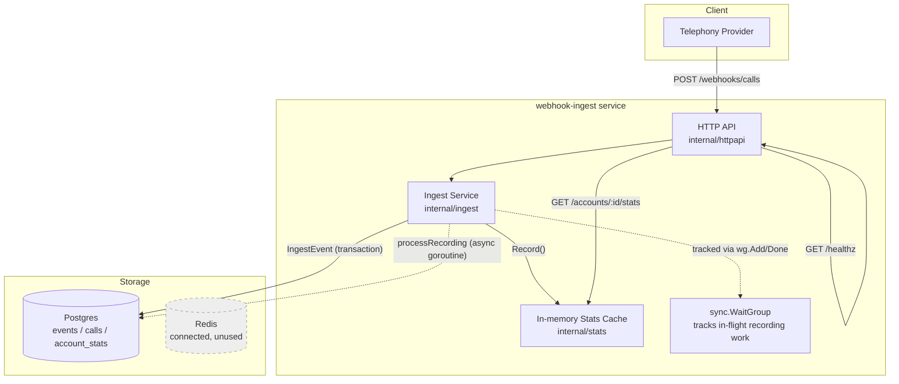
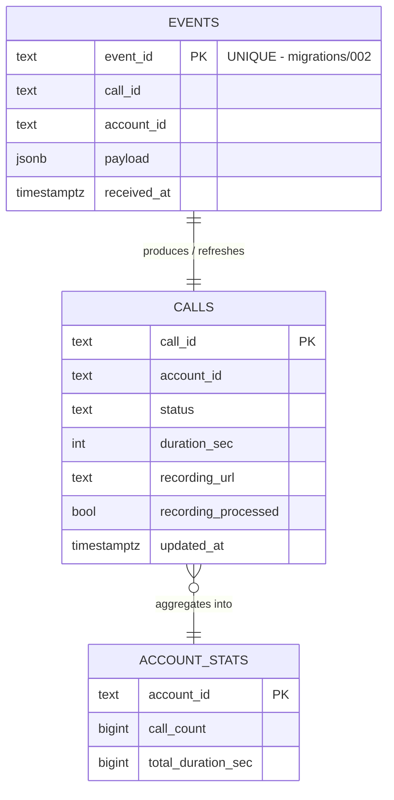
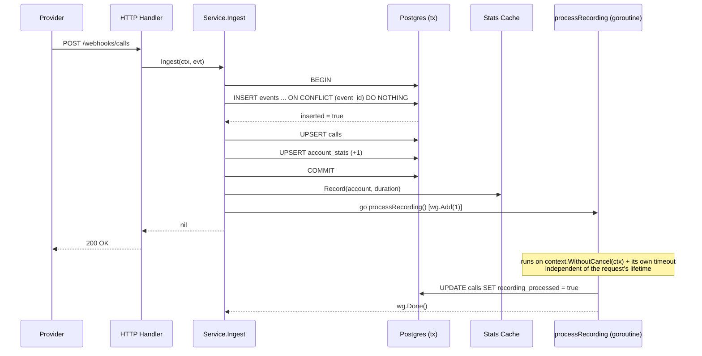
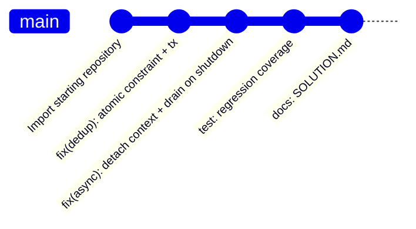

# webhook-ingest

A Go service that receives call-completion webhooks from a telephony provider, stores them durably, and maintains per-account call statistics — built to survive **at-least-once delivery** without double-counting or losing in-flight work on deploy.

## Contents

- [Overview](#overview)
- [The incident](#the-incident)
- [Architecture](#architecture)
- [Database schema](#database-schema)
- [Request flow](#request-flow)
- [Getting started](#getting-started)
- [API](#api)
- [Project layout](#project-layout)
- [What was fixed](#what-was-fixed)
- [Testing](#testing)
- [Development history](#development-history)

## Overview

The provider retries any non-2xx response and will occasionally redeliver an event even after a `200`. `event_id` is stable across redeliveries — ingestion must be idempotent on it. See [SOLUTION.md](./SOLUTION.md) for the defects found, why each fix was made, and the deduplication design decision.

## The incident

> Duplicate call records are showing up in the dashboard, and account call-counts are drifting higher than the actual number of calls. Calls are landing but their recordings never get marked processed — and there's nothing in the logs about it. On top of that, every time we deploy, whatever was in flight seems to just disappear.

Three symptoms, three root causes — all detailed in [SOLUTION.md](./SOLUTION.md).

## Architecture



## Database schema



## Request flow

Happy path, after the fix — one atomic transaction decides idempotency, and background work is fully detached from the request lifecycle:



## Getting started

You need Docker and Go 1.25+.

```bash
unzip webhook-ingest.zip
cd webhook-ingest
docker compose up -d --build   # Postgres, Redis, and the service
curl localhost:8080/healthz    # -> ok
go test ./...                  # full suite, including the new regression tests
```

`make reset` tears everything down, wipes the volumes, and starts fresh. Migrations are plain SQL in `migrations/`, applied on first start of an empty volume.

Already running Postgres or Redis locally? Copy `.env.example` to `.env`, override `APP_PORT`, `POSTGRES_PORT`, `REDIS_PORT`, and point `DATABASE_URL` / `REDIS_ADDR` at your chosen ports.

## API

| Endpoint | Purpose |
|---|---|
| `POST /webhooks/calls` | Receive one call-completion event |
| `GET /accounts/{id}/stats` | Per-account totals from the in-memory aggregate (durable copy in `account_stats`) |
| `GET /healthz` | Liveness check |

```json
{
  "event_id": "evt_01H8XK2M9P",
  "call_id": "call_9f2ab31c",
  "account_id": "acc_123",
  "status": "completed",
  "duration_sec": 143,
  "recording_url": "https://recordings.example.com/9f2ab31c.wav",
  "occurred_at": "2026-08-13T09:12:00Z"
}
```

## Project layout

```
cmd/server/          entrypoint and wiring
internal/config/      environment configuration
internal/store/       Postgres repository (IngestEvent = atomic dedup + upsert + increment)
internal/stats/       in-memory per-account totals
internal/ingest/       webhook ingestion and processing
internal/httpapi/     routes and handlers
internal/redisclient/ Redis connection
internal/testutil/    shared test setup
migrations/           schema (002_dedup_events.sql adds the UNIQUE constraint)
```

## What was fixed

Three defects, all present despite a green test run:

1. **Duplicate records / inflated counts** — check-then-insert race on redelivery, no DB-level uniqueness.
2. **Recordings never marked processed** — background goroutine inherited the request's (immediately-cancelled) context; the error was silently discarded.
3. **In-flight work lost on deploy** — that goroutine was untracked, so graceful shutdown had no idea it existed.

Full root-cause analysis, before/after diagrams, and the deduplication design decision: **[SOLUTION.md](./SOLUTION.md)**.

## Testing

```bash
go test ./... -v
```

New regression tests:

- `TestConcurrentDuplicateDeliveriesAreNotDoubleCounted` — fires the same `event_id` from many goroutines at once; fails on the old check-then-insert code, passes with the atomic constraint.
- `TestRecordingIsMarkedProcessedAfterAsyncWork` — polls well past the window in which the old code's context was cancelled.
- `TestWaitBlocksUntilBackgroundWorkFinishes` — confirms `Service.Wait` actually blocks shutdown on in-flight recording work.

## Development history

