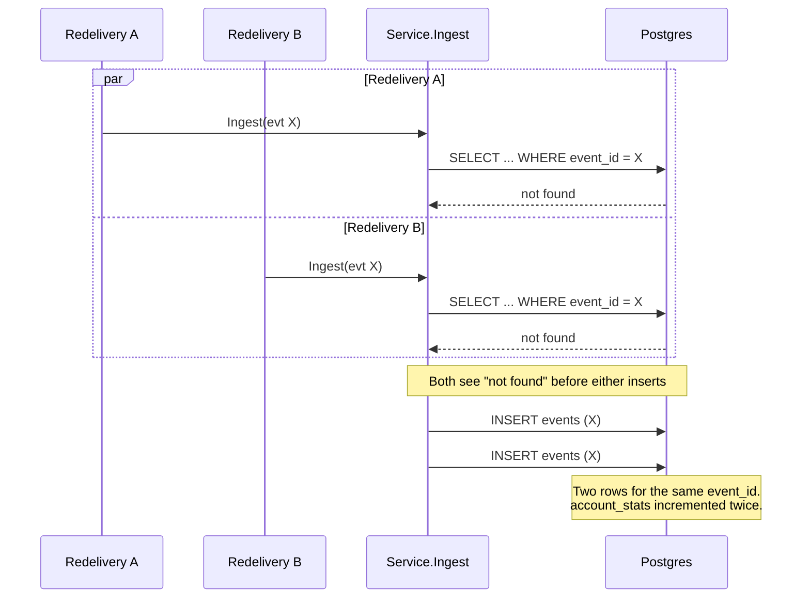
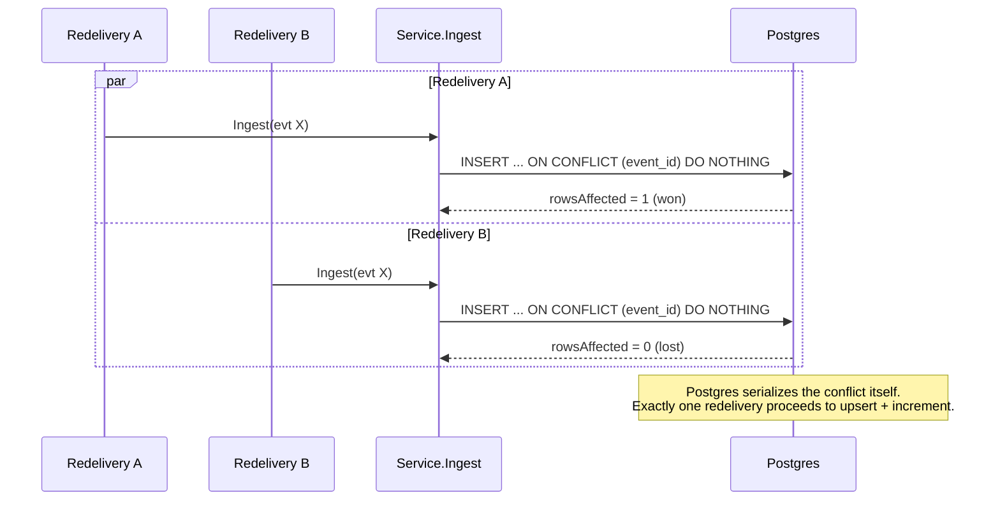
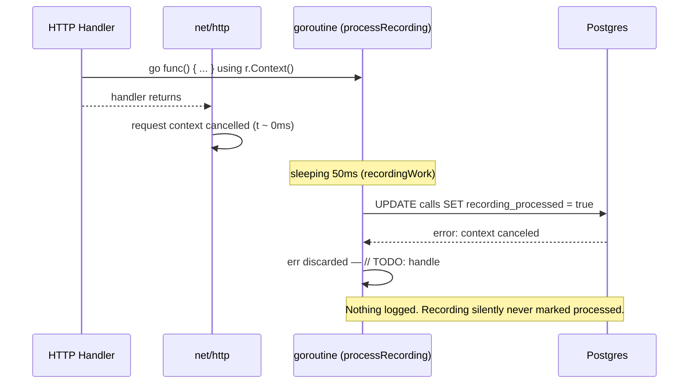
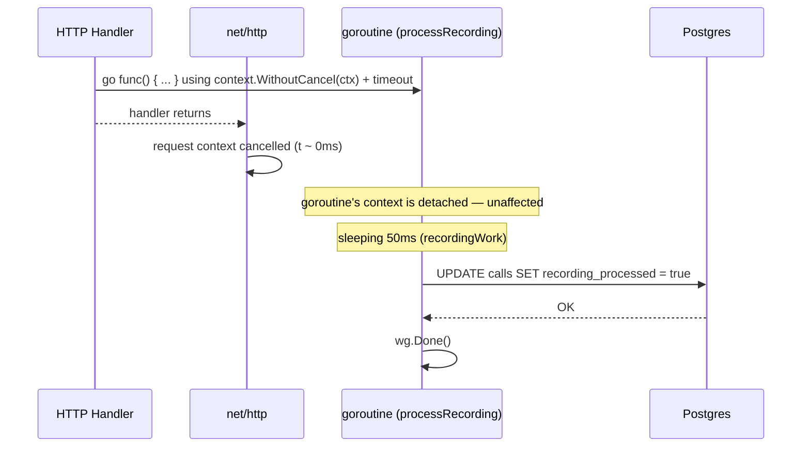
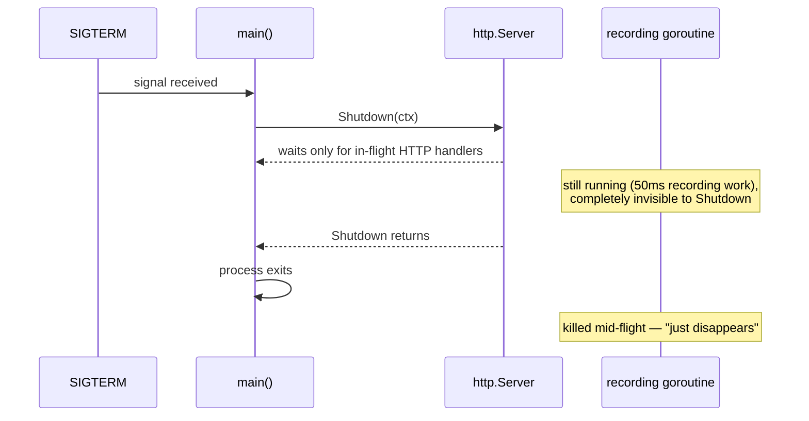
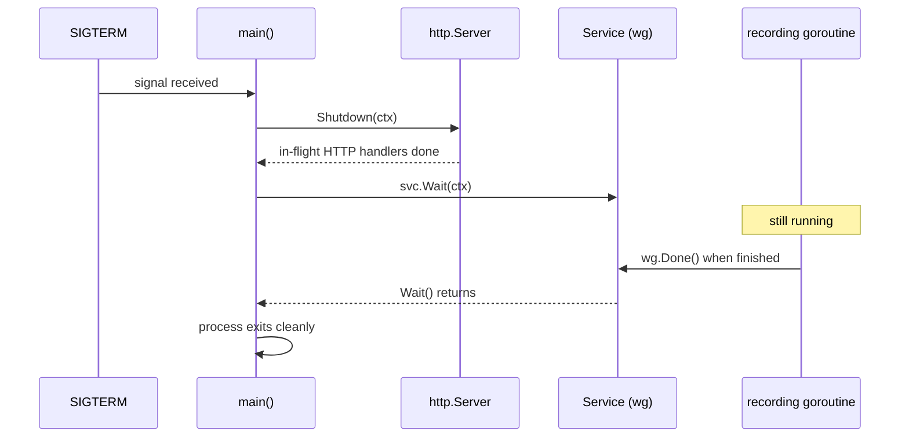
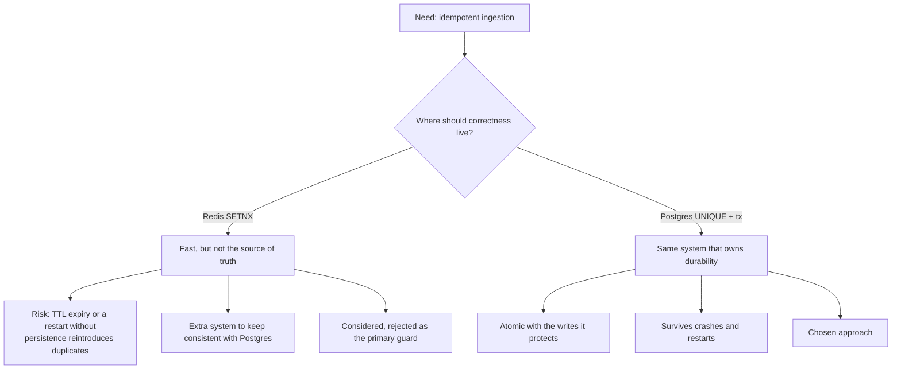
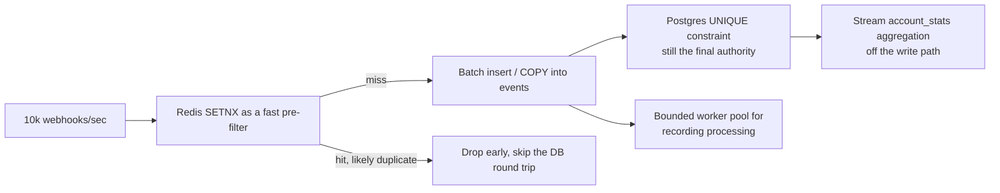

# SOLUTION.md

Three defects were found by working back from the ops report to the code, not from the visible test suite (which passes on the buggy code and doesn't cover any of these).

## 1. Duplicate records and inflated call-counts

**Cause.** `Ingest` decided whether an event was new with `EventExists` (a `SELECT`) followed by a separate `InsertEvent`. Nothing made those two statements atomic, and `events` had no uniqueness constraint on `event_id` — only a plain index.

This matches the ops report exactly: duplicate rows in `events` (shown on the dashboard) and `account_stats.call_count` drifting above the true call count. The existing `TestDuplicateDeliveryIsIgnored` sends deliveries **sequentially**, so it never opens the race window — that's why it stayed green.

**Fix.** A `UNIQUE` constraint on `events.event_id` (`migrations/002_dedup_events.sql`) plus a single `INSERT ... ON CONFLICT (event_id) DO NOTHING`, wrapped in a transaction with the call upsert and the stats increment (`store.IngestEvent`):

The transaction also closes a narrower gap: without it, a failure between `InsertEvent` and `IncrementAccountStats` would leave the event marked "seen" with the stats increment lost — a retry would then be wrongly treated as a duplicate instead of retried.

## 2. Recordings never marked processed, nothing in the logs

**Cause.** `processRecording` ran in a goroutine using the *request's* `context.Context`. `net/http` cancels that context the instant the handler returns — which happens right after the goroutine is spawned, well before the 50ms simulated work finishes. The later DB update almost always ran against an already-cancelled context and failed immediately. The error was silently discarded (`// TODO: handle`), which is exactly why nothing showed up in the logs.

**Fix.** Detach the goroutine from request cancellation with `context.WithoutCancel`, bound it with its own timeout, and log the failure instead of dropping it:

## 3. In-flight work disappearing on deploy

**Cause.** The recording goroutine was completely untracked. `srv.Shutdown` only waits for HTTP handlers still in flight — it has no idea a handler spawned background work after it already returned. `main` exits right after `Shutdown`, killing anything mid-flight.

**Fix.** A `sync.WaitGroup` on `Service`, incremented before each recording goroutine and decremented when it finishes, plus a new `Service.Wait(ctx)` that `main` calls after `srv.Shutdown`:

## Why this deduplication strategy

Postgres (`UNIQUE` constraint + `ON CONFLICT DO NOTHING`, inside a transaction) was chosen over Redis (`SETNX event:<id>`), because Postgres already owns durability for this data — putting the correctness guarantee there means "inserted" and "committed" are the same fact, with nothing else to fall out of sync.

Application-level locking (a mutex per `event_id`) wasn't viable either — redeliveries typically arrive on different connections or replicas, so an in-process lock wouldn't see them.

## At 10,000 webhooks/sec

The transaction-per-request round trip to Postgres becomes the bottleneck well before that volume:

- **Redis as a pre-filter, not the source of truth** — cuts DB round trips for the common redelivery case, while the Postgres constraint still backstops correctness for anything that gets past it.
- **Batch/COPY inserts** for `events` instead of one `INSERT` per request.
- **Move `account_stats` off the hot path** — treat `events` as an append-only log and aggregate downstream instead of one `UPDATE ... SET x = x + 1` per event, which serializes writes per account.
- **Bounded worker pool** for `processRecording` — one goroutine per request has no concurrency limit today; at this volume it needs a real queue.

## What I'd do with more time

Load-test the concurrent-dedup fix under real contention (pgbench-style), and check for lock contention on `account_stats` for high-volume accounts — the current single-row increment is correct but serializes all writes for one account, which will show up before 10k/sec is reached.